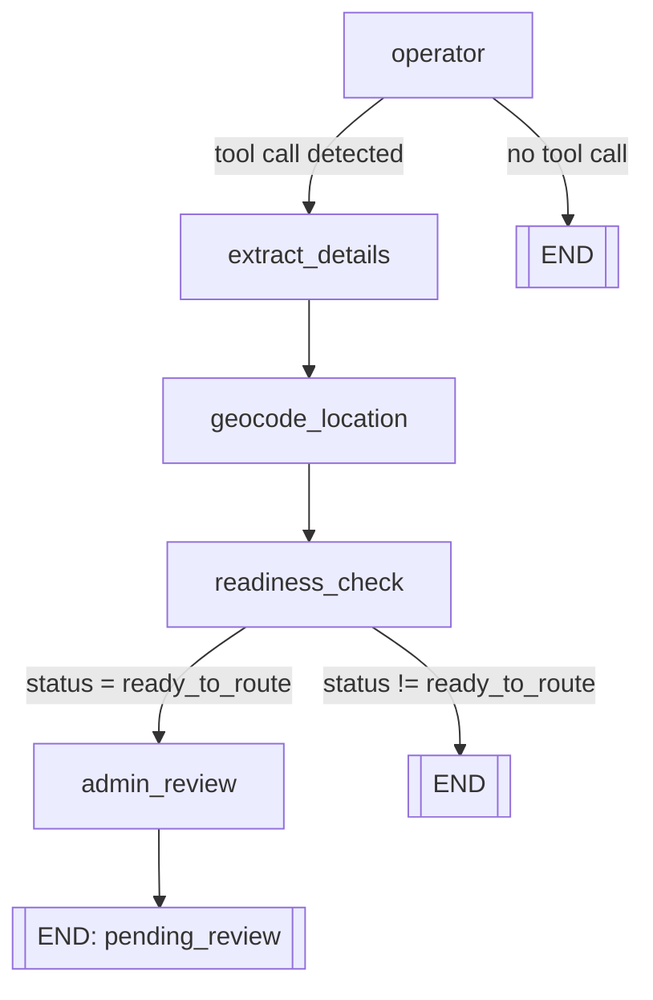

# uffun - Centralized Emergency Routing Hub

*Every second counts.*

## Domain: Intelligent Systems and Data 
UFFUN is an AI-powered emergency response and call management platform built for the Philippine context, especially in rural areas, where callers often face too many local hotline numbers.

## Problem We Addressed

In many Philippine areas, especially outside major cities, emergency response can be delayed because:
- people do not memorize the correct hotline for their exact location.

For a  person in a panic, recall is almost impossible.

Even with a national hotline (`911`), coverage and responsiveness can vary by location. Most rural areas remain effectively disconnected from the national hotline.

In time-critical situations, every second matters.

## Our Solution

> UFFUN, means "tulong" or "help" in ibanag—a dialect in the northern region of the Philippines.

UFFUN acts as a centralized AI layer between callers and responders.

Instead of forcing people to memorize multiple numbers, the system allows a user to describe the emergency in natural language. UFFUN then:
- understands the report,
- detects emergency type and urgency,
- resolves location,
- recommends and routes to appropriate nearby responders,
- optionally sends the case to a human command center for approval.

### Live Demo

- [UFFUN.AI Live App](https://afi-uffun-a334d865ae0c.herokuapp.com/login)

### Realistic Scenario

A caller from a rural municipality reports:
> "Help! My father is having a heart attack."

With UFFUN.AI:
- the system classifies this as a **medical emergency**,
- maps the caller location,
- identifies nearby medical responders,
- prepares dispatch recommendations in real time,
- and allows command center staff to approve/override before final dispatch in simulation mode.

## What We Built In This Codebase

### 1. Fullstack Emergency Platform
- **Frontend**: React + TypeScript + Vite (`/client`)
- **Backend**: FastAPI + LangGraph/LangChain + SQLAlchemy (`/server`)
- **Database**: SQLite (local fallback) or PostgreSQL via `DATABASE_URL`

### 2. AI Emergency Operator Workflow
Implemented a graph-based AI operator in `server/app/services/ai/agent.py` with nodes for:
- operator interaction,
- detail extraction,
- location geocoding,
- readiness checking,
- human review gating,
- geographic hotline routing,
- dispatch confirmation,
- simulation handling.

#### LangGraph Workflow Diagram



### 3. Caller Experience (Emergency Interface)
Implemented in `client/src/components/CallInterface.tsx`:
- location permission flow (with demo location simulation),
- live AI-style call interface,
- emergency text input handling,
- backend call processing via `/api/call/message`,
- pending-review status polling via `/api/call/status`.

### 4. Human-in-the-Loop Command Center
Implemented in `client/src/components/CommandCenter.tsx` + backend admin APIs:
- queue of pending emergency reviews,
- AI-extracted summary and emergency type visibility,
- map-based incident view,
- recommended responder units,
- approve/reject with optional hotline override.

### 5. Admin Analytics Dashboard
Implemented in `client/src/components/AdminDashboard.tsx` with APIs in `server/app/api/admin.py`:
- total and 24h report metrics,
- severity scoring overview,
- status distribution,
- weekly trend charts,
- emergency-type mix chart,
- incident heatmap,
- recent reports table.

### 6. Authentication + Role-Based Views
Implemented basic role-auth flow:
- `/api/auth/login` for backend login,
- role-aware protected routes on frontend (`caller` vs `admin`),
- demo users seeded in DB.

### 7. Deployment-Ready Structure
- Docker support (`Dockerfile`)
- Heroku process config (`heroku.yml`)
- Static frontend serving through FastAPI in production mode
- `/health` endpoint for health checks

## Project Structure

```text
afi-uffun/
  client/                 # React frontend
  server/
    app/
      api/                # call, admin, auth endpoints
      core/               # LLM configuration
      data/               # hotline + emergency knowledge seed data
      services/
        ai/               # LangGraph workflow nodes and state
        database/         # DB access layer
      database.py         # engine, session, init, seeding
      main.py             # FastAPI entrypoint
```

## Key API Endpoints

### Call Flow
- `POST /api/call/message` - process caller message through AI workflow
- `GET /api/call/status?call_id=...` - poll pending review results

### Admin Flow
- `GET /api/admin/pending` - list pending human reviews
- `POST /api/admin/review/approve` - approve with optional hotline overrides
- `POST /api/admin/review/reject` - reject and request clarification
- `GET /api/admin/hotlines` - available hotline units

### Admin Analytics
- `GET /api/admin/metrics`
- `GET /api/admin/breakdown`
- `GET /api/admin/heatmap`
- `GET /api/admin/reports`

### Auth
- `POST /api/auth/login`

## Demo Accounts (Seeded)

From `server/app/database.py`:
- Caller: `caller@demo.local` / `demo-caller`
- Admin: `admin@demo.local` / `demo-admin`

## Local Setup

### Backend
```bash
cd server
python -m venv .venv
# activate venv
pip install -r requirements.txt
# set GROQ_API_KEY in server/.env
uvicorn app.main:app --reload
```

### Frontend
```bash
cd client
npm install
npm run dev
```

## Notes and Limitations

- This project is currently in **simulation mode** for dispatch.
- Voice call ingestion is not yet enabled; input is text-based.
- Auth is demo-grade and does not yet use secure password hashing/token lifecycle.
- Mock data for hotlines and emergency types.
- Geocoding/routing logic can be expanded with richer regional responder data.
- Language support is currently limited to **English and Tagalog**.

## Hackathon Summary

For this hackathon, we built a working end-to-end prototype that demonstrates:
- AI-assisted emergency understanding,
- location-aware responder recommendation,
- human-in-the-loop approval,
- and command-center analytics.

The core value is simple: **one intelligent access point for emergencies**, especially helpful in regions where hotline fragmentation creates delays.
